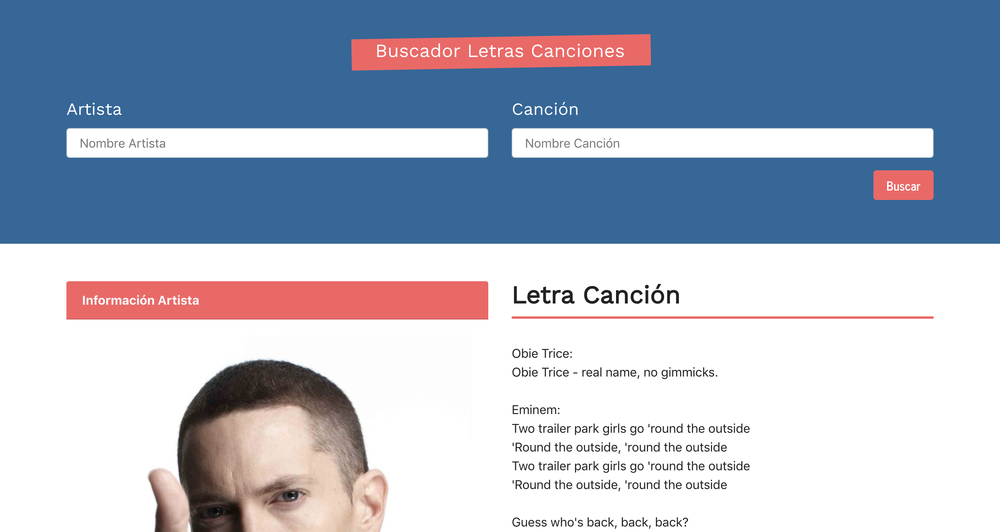

# SONGS LETTERS

### Deploy link: [music-letters](https://music-letters.netlify.app)


The aim of this project was to take information from different API's using different
fetch calls and making a good look and field thanks to Bootstrap.

## Functional Description

User will have the chance to: search song letters, singers biography and their social media.

## Technical Description

Front-End part developed with: React, CSS with Bootstrap.

## Requisites

Have installed node (+npm)

Start the react site by using the following command:
````
npm run start 
````

-------------
This project was bootstrapped with [Create React App](https://github.com/facebook/create-react-app).